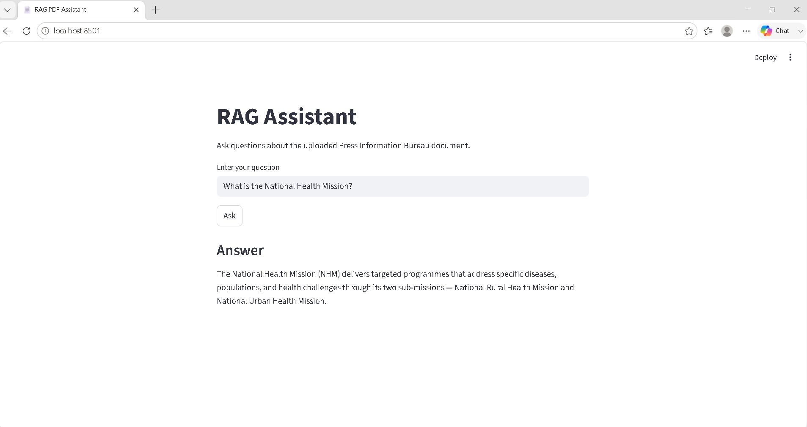

# 📄 RAG Q&A Assistant

> A Retrieval-Augmented Generation (RAG) application that answers questions from a Press Information Bureau (PIB) document using semantic search, FAISS vector database, and Groq Llama 3.3.


---

#  Project Overview

Traditional Large Language Models generate answers based on their pre-trained knowledge, which may become outdated or produce hallucinations.

This project implements a **Retrieval-Augmented Generation (RAG)** pipeline that retrieves the most relevant information from a provided Press Information Bureau (PIB) document before generating a response. This ensures answers remain grounded in the source document.

---

#  Features

-  PDF document ingestion
-  Intelligent text chunking
-  Semantic embeddings using Hugging Face
-  FAISS Vector Database
-  Semantic similarity search
-  Groq Llama 3.3 LLM integration
-  Interactive Streamlit interface
-  Hallucination-aware prompt design

---

#  System Architecture

```
                    +--------------------+
                    |     PDF Document   |
                    +---------+----------+
                              |
                              v
                   Text Extraction (PyPDFLoader)
                              |
                              v
          Recursive Character Text Splitter
                              |
                              v
       Hugging Face Embedding Model (MiniLM)
                              |
                              v
                 FAISS Vector Database
                              |
                 User Question
                              |
                              v
                  Semantic Similarity Search
                              |
                    Top Relevant Chunks
                              |
                              v
                 Groq Llama 3.3 LLM
                              |
                              v
                     Generated Answer
```

---

#  Project Structure

```
rag-qa-assistant/
│
├── data/
│   └── documents/
│       └── Press Release Page _ Press Information Bureau.pdf
│
├── src/
│   ├── loader.py
│   ├── splitter.py
│   ├── vector_store.py
│   └── rag_pipeline.py
│
├── vector_db/
│
├── app.py
├── requirements.txt
├── README.md
├── implementation_note.pdf
├── .env.example
└── .gitignore
```

---

#  Technology Stack

| Component | Technology |
|------------|------------|
| Programming Language | Python |
| Framework | LangChain |
| Embedding Model | sentence-transformers/all-MiniLM-L6-v2 |
| Vector Database | FAISS |
| LLM | Groq (Llama 3.3-70B Versatile) |
| Interface | Streamlit |

---

#  RAG Workflow

## Step 1 – Document Ingestion

The PIB PDF is loaded using **PyPDFLoader** from LangChain.


## Step 2 – Text Chunking

The extracted text is divided into smaller overlapping chunks.

**Chunk Size:** 1000

**Chunk Overlap:** 200


## Step 3 – Embedding Generation

Each chunk is converted into dense vector embeddings using

```
sentence-transformers/all-MiniLM-L6-v2
```


## Step 4 – Vector Storage

All embeddings are stored locally using **FAISS**, enabling efficient similarity search.


## Step 5 – Semantic Retrieval

When a user asks a question,

- the question is embedded,
- FAISS retrieves the top-k most relevant chunks.


## Step 6 – Response Generation

The retrieved chunks are supplied as context to **Groq Llama 3.3**, which generates a response strictly based on the retrieved information.

---

#  Installation

Clone the repository

```bash
git clone https://github.com/yourusername/rag-qa-assistant.git

cd rag-qa-assistant
```

Install dependencies

```bash
pip install -r requirements.txt
```

Create a `.env` file

```text
GROQ_API_KEY=your_api_key_here
```

---

#  Running the Project

### Generate Vector Database

```bash
python src/vector_store.py
```

### Run the CLI RAG Assistant

```bash
python src/rag_pipeline.py
```

### Launch Streamlit

```bash
streamlit run app.py
```

---

#  Sample Questions

- What is Ayushman Bharat?
- What healthcare initiatives are mentioned?
- What is the National Health Mission?
- What digital health programmes are discussed?
- What role does Artificial Intelligence play in healthcare?

---

#  Application Screenshot



---

#  Prompt Strategy

The language model is instructed to:

- Use only the retrieved document context.
- Avoid generating unsupported information.
- Respond with:

```
I couldn't find this information in the provided document.
```

whenever the answer is unavailable in the retrieved context.

This minimizes hallucinations and improves factual reliability.

---

#  Future Improvements

- Support multiple PDF documents
- Source page citation
- Conversation memory
- REST API integration

---


